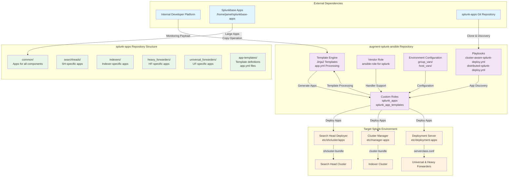
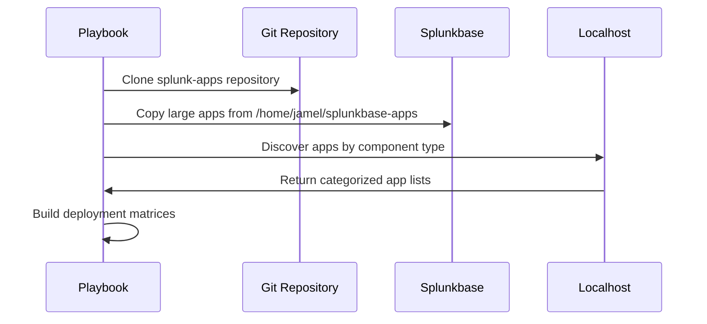
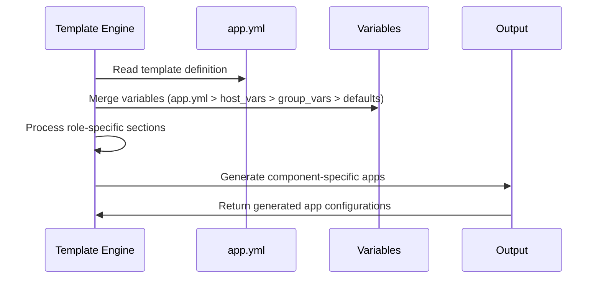
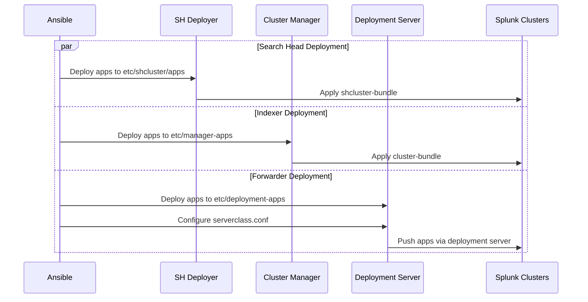
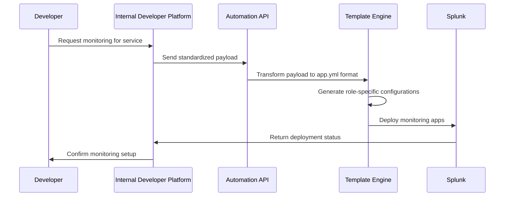

# Splunk Automation Architecture

## Overview

This document describes the architecture, design decisions, and operational aspects of our custom Splunk automation framework built with Ansible. This solution addresses enterprise-scale Splunk deployments with advanced templating, multi-repository management, and integration with Internal Developer Platforms (IDPs).

## Repository Structure & Data Flow



## Architecture Design Decisions

### 1. Monorepo vs Multi-Repo Approach

**Our Choice: Monorepo with Role-Based Directory Structure**

**Motivation:**
- **Simplified Management**: Single repository eliminates complex dependency management across multiple repos
- **Atomic Changes**: Related app changes can be deployed together in a single commit
- **Centralized Governance**: Unified access control, branching strategy, and CI/CD pipeline
- **Cross-Component Coordination**: Easy to manage apps that span multiple Splunk components

**vs. ansible-role-for-splunk's One-Repo-Per-App:**
```
❌ ansible-role-for-splunk approach:
├── splunk-app-1/
├── splunk-app-2/
└── splunk-app-n/

✅ Our monorepo approach:
├── common/           # Apps for all components
├── searchheads/      # Search head specific
├── indexers/         # Indexer specific
├── heavy_forwarders/ # Heavy forwarder specific
├── universal_forwarders/ # Universal forwarder specific
└── app-templates/    # Template definitions
```

### 2. Large File Handling Strategy

**Problem with Git LFS:**
- Complex repository management
- Storage cost implications
- Additional tooling requirements
- Performance issues with large binary files

**Our Solution: Local Copy Operations**
```yaml
# Instead of Git LFS:
- name: Copy Splunkbase apps to matching folders
  shell: |
    for app in "$SPLUNKBASE_APPS_DIR"/*; do
      appname=$(basename "$app")
      target="$MONOREPO_CHECKOUT_DIR/common/$appname"
      if [ -d "$target" ]; then
        cp -r "$app"/* "$target"/
      fi
    done
```

**Benefits:**
- No Git LFS complexity
- Faster operations
- Local control over large files
- Simplified CI/CD pipelines

### 3. Advanced Templating System

**Enhanced app.yml Format:**
```yaml
# Traditional single-target approach
app_name: "monitoring_app"
target_components: ["indexers"]

# Our enhanced multi-target approach
app_name: "monitoring_app"
indexers:
  app_name: "idx_monitoring"
  configs:
    indexes.conf:
      - name: "application_logs"
        maxDataSize: "500MB"
search_heads:
  app_name: "sh_monitoring"
  configs:
    savedsearches.conf:
      - name: "Daily Summary"
        search: "index=application_logs | stats count by host"
```

## Operational Workflow

### 1. Discovery Phase


### 2. Template Processing


### 3. Deployment Phase


## Pros and Cons Analysis

### Overall Architecture

**Pros:**
- ✅ **Unified Management**: Single automation framework for entire Splunk estate
- ✅ **Version Control**: All configurations tracked in Git
- ✅ **Repeatable Deployments**: Infrastructure as Code principles
- ✅ **Environment Consistency**: Same automation across dev/staging/production
- ✅ **Conflict Prevention**: Smart deployment routing prevents management server conflicts
- ✅ **Permission Handling**: Automated permission fixing for Splunk requirements
- ✅ **Scalability**: Handles enterprise-scale deployments efficiently

**Cons:**
- ❌ **Complexity**: Requires Ansible expertise and understanding of Splunk architecture
- ❌ **Learning Curve**: Team members need to understand both Ansible and Splunk deployment patterns
- ❌ **Dependency Management**: Relies on external ansible-role-for-splunk for handlers
- ❌ **Backup Accumulation**: Automated backups can accumulate over time
- ❌ **Permission Challenges**: Splunk's bundle deployment doesn't preserve permissions natively

### Templated Apps Approach

**Pros:**
- ✅ **DRY Principle**: Single template generates multiple role-specific apps
- ✅ **Consistency**: Standardized configurations across components
- ✅ **Maintainability**: Central template updates propagate everywhere
- ✅ **Dynamic Generation**: Runtime generation based on environment variables
- ✅ **IDP Integration**: Easy payload transformation from developer platforms
- ✅ **Backward Compatibility**: Legacy app formats still supported

**Cons:**
- ❌ **Template Complexity**: Complex templates can be hard to debug
- ❌ **Variable Precedence**: Multiple variable sources can create confusion
- ❌ **Generation Overhead**: Template processing adds deployment time
- ❌ **Limited Flexibility**: Some edge cases may not fit template patterns
- ❌ **Testing Complexity**: Need to test both templates and generated outputs

### Monorepo Strategy

**Pros:**
- ✅ **Simplified Workflows**: Single clone operation for all apps
- ✅ **Atomic Changes**: Related changes deployed together
- ✅ **Centralized Governance**: Single access control and review process
- ✅ **Cross-Component Visibility**: Easy to see relationships between apps
- ✅ **Unified CI/CD**: Single pipeline for all Splunk apps

**Cons:**
- ❌ **Repository Size**: Can become large with many apps
- ❌ **Merge Conflicts**: Higher likelihood of conflicts with many contributors
- ❌ **Blast Radius**: Issues in one app can affect entire repository
- ❌ **Team Coordination**: Requires coordination between teams working on different apps
- ❌ **Clone Time**: Larger repository takes longer to clone

## Integration with Internal Developer Platform (IDP)

### Payload Transformation Workflow



### IDP Payload Example

**Input from IDP:**
```json
{
  "service_name": "user-service",
  "environment": "production",
  "monitoring_requirements": {
    "logs": {
      "index": "application_logs",
      "retention_days": 365,
      "sources": ["/var/log/user-service/*.log"]
    },
    "metrics": {
      "index": "application_metrics",
      "collection_interval": 60
    },
    "alerts": {
      "error_threshold": 10,
      "response_time_threshold": 5000
    }
  },
  "deployment_targets": ["search_heads", "universal_forwarders"]
}
```

**Generated app.yml:**
```yaml
app_name: "user_service_monitoring"
tenant: "production"
environment: "production"

universal_forwarders:
  app_name: "user_service_uf_monitoring"
  configs:
    inputs.conf:
      - source: "/var/log/user-service/*.log"
        index: "application_logs"
        sourcetype: "user_service_logs"

search_heads:
  app_name: "user_service_sh_monitoring"
  configs:
    savedsearches.conf:
      - name: "User Service Error Alert"
        search: 'index=application_logs sourcetype=user_service_logs level=ERROR'
        alert_threshold: 10
        cron_schedule: "*/5 * * * *"
```

### Benefits for IDP Integration

1. **Standardized Interface**: Consistent API for all monitoring requests
2. **Self-Service**: Developers can provision monitoring without ops team intervention
3. **Compliance**: Automated enforcement of retention, indexing, and alerting policies
4. **Rapid Deployment**: Minutes from request to active monitoring
5. **Version Control**: All monitoring configurations tracked in Git
6. **Rollback Capability**: Easy rollback through Git history

### Implementation Considerations

1. **API Gateway**: RESTful API to receive IDP payloads
2. **Validation Layer**: Ensure payloads meet organizational standards
3. **Template Library**: Pre-built templates for common monitoring patterns
4. **Async Processing**: Queue-based processing for large deployments
5. **Status Tracking**: Real-time status updates back to IDP
6. **Error Handling**: Graceful handling of deployment failures

## Maintenance and Operations

### Regular Maintenance Tasks

1. **Backup Cleanup**: Periodic removal of old backup files
2. **Permission Audits**: Regular verification of Splunk app permissions
3. **Template Updates**: Updating templates for new Splunk versions
4. **Dependency Updates**: Keeping ansible-role-for-splunk current
5. **Security Patches**: Applying security updates to base apps

### Monitoring and Alerting

1. **Deployment Success**: Monitor Ansible playbook execution
2. **Bundle Application**: Track Splunk cluster bundle deployments
3. **App Health**: Monitor deployed app functionality
4. **Permission Issues**: Alert on permission-related failures
5. **Repository Changes**: Track changes to critical configuration files

### Troubleshooting Common Issues

1. **Permission Errors**: Use unified permission fixing tasks
2. **Deployment Conflicts**: Check serverclass exclusions
3. **Template Failures**: Validate variable precedence and syntax
4. **Large File Issues**: Verify Splunkbase app copying
5. **Handler Failures**: Check Splunk service status and authentication

## Future Enhancements

1. **Advanced Templating**: Support for more complex Splunk configurations
2. **Testing Framework**: Automated testing of generated apps
3. **Blue-Green Deployments**: Zero-downtime app deployments
4. **Multi-Tenant Support**: Enhanced isolation between tenants
5. **Performance Optimization**: Faster template processing and deployment
6. **Integration APIs**: Enhanced IDP integration capabilities
7. **Compliance Reporting**: Automated compliance and audit reporting